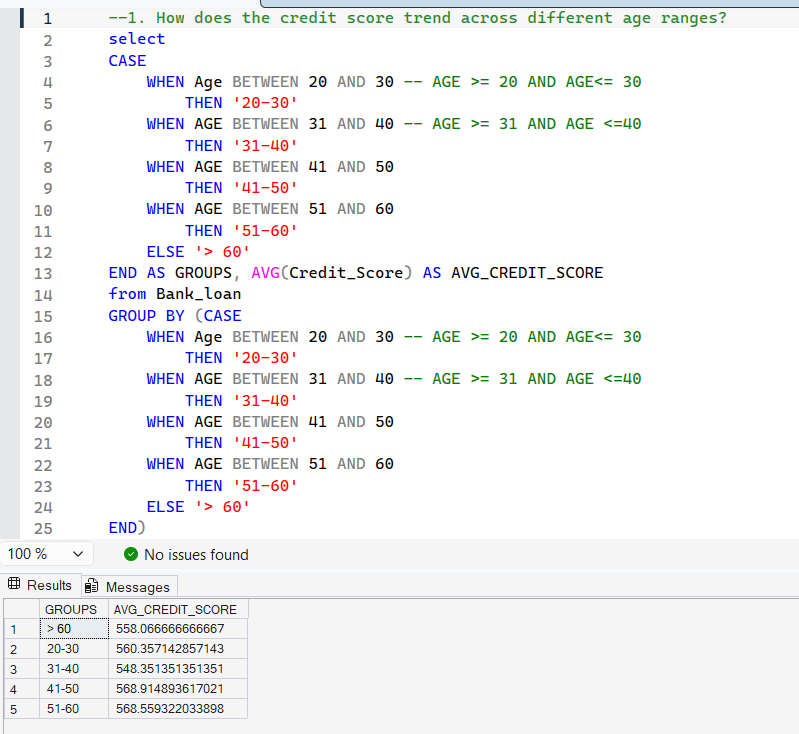
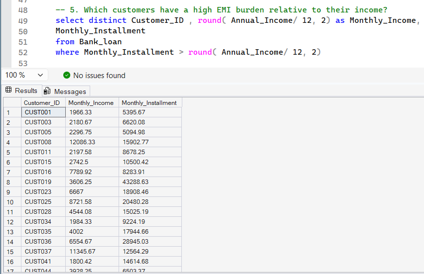

# 🏦 Bank Loan Analysis Using SQL

## 📌 Project Overview

This project focuses on analyzing bank loan customer data using SQL queries to identify:

- Credit score trends across different age groups
- Customers with high EMI burden
- Loan default trends across employment categories

The project helps financial institutions improve:

- Risk assessment
- Loan approval strategies
- Customer segmentation
- Loan default prediction

---

# 🎯 Project Objective

The objective of this project is to analyze customer loan data using SQL and identify patterns related to:

- Credit behavior
- EMI burden
- Loan default risk
- Employment-based financial trends

# 🛠️ Tools & Technologies Used

- SQL
- SQL Server Management Studio (SSMS)
- Data Analysis
- Financial Analytics

---

# 📂 Database Used

**Database Name:** `Bank_Loan`

---

# 📁 Dataset Information

The dataset contains customer loan-related information such as:

- Customer demographics
- Credit score
- Annual income
- Monthly installment
- Employment status
- Loan default details

---

# 📊 SQL Concepts Used

- CASE Statement
- AVG()
- SUM()
- ROUND()
- GROUP BY
- ORDER BY
- Subqueries
- Conditional Filtering

---

# 📌 Query 1: Credit Score Trend Across Age Groups

## 🎯 Business Problem

Analyze how credit scores vary across different age groups to identify financially stable customer segments.

## 💻 SQL Query

```sql
SELECT 

    CASE
        WHEN Age BETWEEN 20 AND 30 THEN '20-30'
        WHEN Age BETWEEN 31 AND 40 THEN '31-40'
        WHEN Age BETWEEN 41 AND 50 THEN '41-50'
        WHEN Age BETWEEN 51 AND 60 THEN '51-60'
        ELSE 'Above 60'
    END AS Age_Group,

    ROUND(AVG(Credit_Score), 2) AS Avg_Credit_Score

FROM Bank_Loan

GROUP BY 

    CASE
        WHEN Age BETWEEN 20 AND 30 THEN '20-30'
        WHEN Age BETWEEN 31 AND 40 THEN '31-40'
        WHEN Age BETWEEN 41 AND 50 THEN '41-50'
        WHEN Age BETWEEN 51 AND 60 THEN '51-60'
        ELSE 'Above 60'
    END

ORDER BY Avg_Credit_Score DESC;
```

---

## 📷 Query Output



---

## 📈 Key Insights

- Customers aged between 41–60 have comparatively stronger credit scores.
- Higher credit scores indicate better repayment capability.
- Senior customers appear financially more stable.

---

# 📌 Query 2: High EMI Burden Customers

## 🎯 Business Problem

Identify customers whose monthly EMI exceeds their monthly income.

## 💻 SQL Query

```sql
SELECT DISTINCT

    Customer_ID,

    ROUND(Annual_Income / 12, 2) AS Monthly_Income,

    Monthly_Installment,

    ROUND(
        (Monthly_Installment / (Annual_Income / 12)) * 100,
        2
    ) AS EMI_Burden_Percentage

FROM Bank_Loan

WHERE Monthly_Installment > (Annual_Income / 12)

ORDER BY EMI_Burden_Percentage DESC;
```

---

## 📷 Query Output


---

## 📈 Business Insights

- Several customers are paying EMI greater than their monthly income.
- Such customers are considered financially stressed.
- Banks can use this analysis to identify high-risk borrowers.

---

# 📌 Query 3: Default Rate Across Employment Status

## 🎯 Business Problem

Analyze loan default contribution across employment categories.

## 💻 SQL Query

```sql
SELECT 

    Employment_Status,

    SUM(Defaulted) AS Total_Defaults,

    ROUND(
        (SUM(Defaulted) * 100.0) /
        (SELECT SUM(Defaulted) FROM Bank_Loan),
        2
    ) AS Default_Rate_Percentage

FROM Bank_Loan

GROUP BY Employment_Status

ORDER BY Default_Rate_Percentage DESC;
```

---

## 📷 Query Output



---

## 📈 Business Insights

- Certain employment categories contribute more heavily to loan defaults.
- Employment stability directly impacts repayment behavior.
- This analysis helps banks improve lending decisions and risk profiling.

---

# 📈 Business Impact

This analysis can help financial institutions:

- Identify high-risk borrowers
- Improve loan approval decisions
- Reduce loan default probability
- Enhance customer risk profiling

---

# ✅ Final Conclusion

This SQL project demonstrates how SQL can be used for:

- Financial Analytics
- Customer Risk Profiling
- Loan Default Analysis
- Business Intelligence

The project identifies risky borrowers and provides meaningful insights for better loan approval strategies.

---

# ⭐ Key Skills Demonstrated

- SQL Query Writing
- Financial Data Analysis
- Business Problem Solving
- Analytical Thinking
- Risk Analysis
- Data Aggregation

---

# 📚 Key Learnings

- Improved SQL query writing skills
- Learned customer risk analysis
- Performed financial data analysis
- Used aggregate functions for business reporting
- Generated actionable business insights


# 👩‍💻 Author

## Astuti

SQL | Power BI | Python | Excel | Data Analytics Enthusiast

---
⭐ If you found this project useful, feel free to explore the repository.
